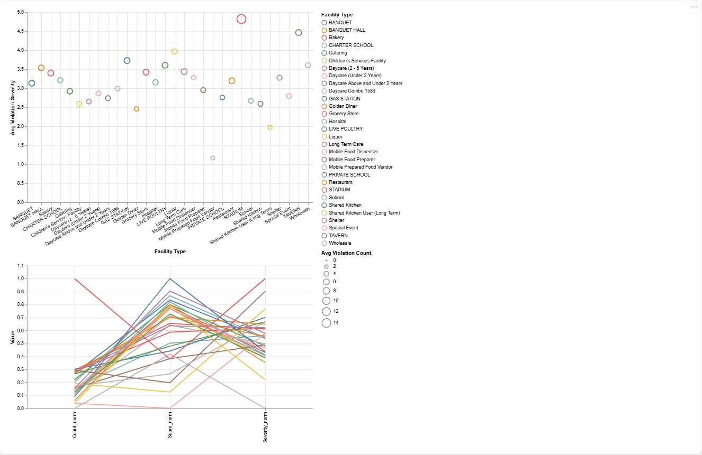

## Dataset Description

This data was obtained from the Chicago Department of Public Health's records of food inspections. Each record in the dataset relates to a food safety inspection that occurred at a licensed food establishment. The dataset extends from 2019 to late 2024 and contains a variety of characteristics, including:

- Date of Inspection
- Facility Type
- Inspection Status (Pass, Pass w/ Conditions, Fail)
- Description of Violations
- ZIP Code
- Risk Level

This data was cleaned and preprocessed in a Python (Pandas) environment, including replacing missing values, extracting counts of violations, severity of violations, and mapping results to numerical scores when appropriate. The dataset was well-suited to aspirations for exploratory visual analysis of public health settings for understanding trends, analysis of geographic disparities in inspection outcomes and factors contributing to the frequency of violations.

## Linked View 1: Failure Rate Over Time vs ZIP Code

### Goal

To search whether food inspection failure rates change over the time and to find ZIP codes with the highest failure rates from some interval.

### Visual Encodings

- **Top Panel (Line Chart):** Providing a daily failure rate across all inspections over time.
  - `x-axis:` Inspection Date
  - `y-axis:`  Failure Rate (failed inspections as a ratio per day)
  - Color: with failure rate encoded as color saturation (through color legend)

- **Bottom Panel (Horizontal Bar Chart):** Showing the top 30 ZIPs with the highest failure rates for the selected time window.
  - `x-axis:` Failure Rate
  - `y-axis:` ZIP Code (ranked by failure rate)
  - Color: encoded magnitude of failure rate (light to dark red)

### Interaction

- **Level selection** brushing action on top time-series chart filters the lower chart.
  - Users brush over their desired range of dates, dynamically recalculating the respective ZIP codes shown in the lower panel depending on the brushed time.
  - Also assists in determining geographical hotspots during outbreak events or policy changes.

### Data Transformations

-  Inspection results were mapped to binary: Fail = 1, Pass/Pass w/ Conditions = 0.
-  Inspections were aggregated on a daily basis to produce the failure rate.
-  ZIP codes were grouped and then ranked by their average failure rate within the brushed time window.

### Design Decisions

- A line graph was chosen to represent temporal variations and establish trajectory.
- A bar chart was utilized to allow for a quick visual comparison of ZIP codes.
- Color coding conveys severity, and represents a secondary visual encoding for sorting.

### Takeaways 

- Failure rates exhibit sharp periodic spikes, which may be correlated to seasonal audits or interventions directly tied to individual ZIP codes.
- Frequent ZIP codes are observed in the top 30 regardless of time frame selected, which suggests chronic problems in those specific neighborhoods.

### Challenges 

- Data contained missing or malformed ZIP codes which were filtered out.
- High temporal resolution resulted in noise that would generally warrant smoothing; however, we wanted to maintain actual spikes.

## Linked View 2: Facility Type vs. Monthly Inspection Volume

<!-- 

### Aim

To discover changes in the number of inspections by facility type, and to reveal changes in inspections due to time: which facility types are inspected at a greater rate, and which facility types have stable inspection rates as opposed to event driven rates.

### Visual Encodings

- **Top Panel (Horizontal Bar Chart)**:
  - Displays the top 20 facility types with the most inspections.
  - `x-axis` – Total inspection quantity
  - `y-axis` – Facility Type (sorted by count)
  - Color – Encodes selected facility types (with highlighted selections in orange and other selections in grey)

- **Bottom Panel (Area Chart)**:
  - Displays monthly inspection volume for the selected facility type.
  - `x-axis` – Month-Year (Inspection Date aggregated to a month)
  - `y-axis` – Inspection Count

### Interaction

- **Click-to-filter** to select a facility type in the top chart. This automatically updates the time series view below to show only inspections for that facility type. 
- With this clickable interaction, users have the ability to perform a deeper analysis into how inspection volume varies in association with facility type (e.g. a facility type might have more inspections than another potentially due to systemic regulatory changes that have driven up its inspections vs regulatory driven inspection volume), while also allowing them to find spikes or stagnation patterns throughout time, and/or as it relates to other facility types.

### Data Transformations

- The facility types were grouped and counted to indicate the top 20 by frequency.
- The bottom chart aggregated inspections by month (`Inspection Date` → `month-year`) and filtered based on facility type selected.

### Design Choices

- We utilized a bar chart to represent ordering and choosing of categorical values intuitively. 
- While an area chart shows volume, it also supports visualizing progressions over time. The area chart allows quick visual recognition of drops in seasonal or COVID-based capacity, and shows trends of inspection volume across time. 
- A muted gray/orange colour scheme helps better reflect selected vs unselected categories.

### Key Insights

- There are a small number of facility types (e.g., long-term care, grocery stores, and restaurants) that account for a more significant volume of inspections. 
- Several facility types showed declines in inspections mid-2020 and early 2022, possibly caused by COVID-19 lockdowns or delays in inspections. 
- Inspections of pop-up kitchens, or special event-based inspections showed seasonal volume spikes.

### Challenges

- There was a mix of facility naming convention (e.g., daycares could follow at least three formats), so we started with clarity and standardization. 
- There was sparse data for some categories which created noisy, especially flat-looking lines in the time series; it was also decided to only include the top 20 types to limit visual clutter.

## Linked View 3: Risk Level vs. Violation Code Frequency -->

### Objective

To explore the patterns of violations in relation to different risk levels and understand the most frequent violation codes for different categories of risk. This provides context on the severity of operational issues flagged by inspectors.

### Visual Encodings

- **Top Panel (Point Chart)**:
  - Shows selectable risk levels (1 = High Risk, 2 = Medium Risk, 3 = Low Risk)
  - `x-axis`: Risk Level (categorical)
  - `y-axis`: dummy/stable to center points
  - Color and shape to show which risk level is selected

- **Bottom Panel (Horizontal Bar Chart)**:
  - Shows the top 20 most frequent violation codes for the selected risk level
  - `x-axis`: Count of Violations
  - `y-axis`: Violation Code
  - Color: Encodes frequency using a blue scale (darker the color more frequent)

### Interactivity

- **Click selection**: Clicking on a dot in the top risk level chart filters the bottom bar chart to only show the violations associated with that risk level.
- **Radio buttons** also provide a method of selecting the risk level that is an alternative UI interaction.

### Data Transformations

- Violations were tokenized and connected to their associated risk level as found in the inspection record.
- Violation codes were tokenized and grouped by risk level.
- The top 20 codes were determined based on count per the selected risk level.

### Design Decisions

- A point plot was selected for the interface because of the clean and compact interaction affordance, and it's very easy to click and interpret.
- Color was employed in the bar chart to reinforce the relative expected magnitude of each type of violation. 
- Both chart layers feature minimal affordances to avoid confusion and support fast comprehension and comparisons across  risk categories. 

### Key Insights

- Risk Level 1 (High Risk) is consistently presented with the most important violation codes (e.g., Code 3, 5, 57, 37).
- Risk Levels 2 and 3 tend to feature more process-oriented violations or documentations, which usually have very low counts.
- Some of the violation codes actually show up across all risk levels, which indicates that some issues are universal (e.g., cleanliness, pest control).

### Challenges

- Violation codes are numeric, and are not very informative alone. Much of the interpretation relies on familiarity with the domain when there were no legends/descriptions provided.
- In some cases risk level data were absent or inconsistent, and required some cleaning before reliable groupings could be achieved.

## Linked View 3: Yearly Facility Inspection Distribution vs. Monthly Failure Rate

### Purpose

To explore how counts of inspections for different facility types connect to average failure rates, within a single year. This perspective allows the user to see if the volume of inspection relates to the severity of the inspection outcome over time.

### Visual Encodings

- Top panel (horizontal bar):
  - Displays the top ten most commonly inspected facility types for your selected year.
  - X-axis: inspection counts
  - Y-axis: Facility type (sorted)
  - Color: Single tone (blue) for function, maintainability, focus.

- Bottom panel (line):
  - Displays month by month average monthly failure rate for your selected year.
  - X-axis: Month
  - Y-axis: Average failure rate
  - Color: Red line indicates when failure rate distributions were plotted.

### Interactions

- The dropdown (lower left) allows the user to select a year from 2019-2024.
- After selecting a year:
  - The top chart updates to show inspection distribution for that year.
  - The bottom chart filters the failure rate data to that year.

### Data Transformations

- Inspections were aggregated by year, facility type to provide counts.
- Averages of failure rates were calculated month by month for each year.
- Both of these results were dynamically filtered based on the selected year.

### Design decisions

- used a drop-down for selecting year for the sake of cleanliness and clarity.
- used a horizontal bar chart for a concise overview of inspection counts.
- depicted the failure rates using a smoothed red-line graph to indicate failure rate trends in time, and whilst ensuring readability.

### Key takeaways

- Each facility type (for each year) consistently accounted for the most inspections, with the majority dominated by having the same facility type (ie. grocery and restaurants).
- Failure rates demonstrate a seasonal trend that reflects higher and lower months.
- Some years (such as 2020–2021) demonstrate more volatility of monthly failure rates because of inspections conducted in the wake of pandemic closures.

### Remaining challenges
- It was finically difficult to deal with sparse or missing months in earlier years when aggregating.
- Yearly filtering required the two views to sync with each other carefully to avoid performance issues or misaligned axis.

## Linked View 4: Multi-View Dashboard – Risk Level, Facility Type, and Violation Patterns

### Purpose Statement

This dashboard brings together failure trends over time by risk level, types of facilities inspected that have the highest inspection counts, and the number of violations per inspection type, in order to provide a high-level understanding of the scope of failures in the food inspection sector, severity of those failures, as well as the contextual information around operations in failing facilities.

### Visual Encoding Choices

- **Top-Left Panel (Heatmap)**:
  - `x-axis`: Time (quarterly data from 2017 Q1-2024 Q4)
  - `y-axis`: Risk Level (High, Medium, Low)
  - Color: Failure rate percentage (dark = low; yellow = high)
  
- **Top-Right Panel (Treemap)**
  - Total inspection volume (by facility type).
  - Each rectangle represents a distinct type of facility.
  - Rectangle area encodes counts of inspections (larger = more inspections).
  - Since there are such a high number of categories, the labels are often truncated and overlapping the rectangle area, as this will create an initial level of clutter.
  - When a certain quarter is selected from the heatmap, this treemap will update to display only facility types inspected during that quarter.

- **Bottom Panel (Box + Strip Plot)**
  - `x-axis`: Inspection Type
  - `y-axis`: Number of Violations per inspection
  - Each boxplot being a summary of violations for a respective inspection type.
  - The overlaid orange circles represent each of the individual violation counts (outliers or raw data).
  - Color: Library of mixed in order to see overlapping.

### Interactions

- **Heatmap (Top-left)**:
  - Hovering over a cell will highlight bar codes values for the associated failure rates relevant to a particular risk level and quarter.
  - Clicking or brushing a time period **will filter both** the Facility Type and inspection Type charts below.

- **Facility Type Line Chart (Top-right)**:
  - Currently updated already based on the quarter chosen in the heatmap.
  - Should help reveal which facility types represent a majority of inspections for a selected time period.

- **Inspection Type Box Plot (Bottom)**: 
  - Also filtered based on heatmap selection.
  - Reveals how each inspection type has different counts of violations (i.e., each routine, complaint, re-inspection).

- **Filtering**: Once a time period **(quarter)** is selected in the heat map, **both other charts UNFILTERED will be updated** effectively filtering down an exhibition from full dataset to a contained context.

### Data Transformations

- Heatmap data was aggregated by quarter and risk level; failure rates were calculated as the ratio of failed inspections to total inspections, facility types were grouped by counts and ordered by frequency, and violation counts were calculated per inspection type and the box plot groups calculation standard quartiles.

### Design Choices

- A heatmap was selected for compact longitudinal comparison across categorical levels (risk).
- A line chart was selected, despite being cluttered, because counts are much more obvious. The "crowding" lessens if filtering by range, thereby limiting density of the labels and increased readability.
- A box plot + strip chart combination provides a statistical summary of the violations but also raw-data perspective of the variance of violations.
- Although crowded at the start, interactivity allows user to examine meaningful slices of data.

### Key Findings

- Risk Level 3 (Low Risk) demonstrates high failure rates across quarters consistently, which suggests that even lower risk facilities are encountering operational issues.
- There are very few facility types (restaurants, groceries) that contribute largely to inspection totals.
- Violation distributions differ dramatically between inspection types; complaint based and follow up inspections seem to have higher median violations and outliers overall.

### Issues

- **Crowded**: The high cardinality of `Facility Type` and `Inspection Type` made collisions in x-axis labels unavoidable. This was somewhat expected and was solved by: 
  - Filtering interactively by time (using the heatmap)
  - Tilting the labels slightly so they did not overlap too much
- **Normalizing data**: Different levels of risk, required grouping and standardizing text values for analysis. 
- **Render**: Boxplot + overlay charts created a significant delay in rendering points when the points were densely populated without previously aggregated data.

### Conclusions

This *Multi-View* dashboard has the potential for both generalized and focused exploration of inspection failures by addressing categorical, temporal, and statistical perspectives. Ultimately, it has a small amount of initial visual complexity general information explorable but allows users to filter down into specific time slices for meaningful and actionable information.

## Linked View 5: Facility-Type Bubble Chart + Parallel Coordinates Plot

### Objective

This linked view allows for a direct comparison of facility types with respect to the average inspection outcomes, number of violations, and severity of violations. The **bubble chart** provides average violation severity and inspection score in the same plot and the **parallel coordinates plot** allows for a close multi-variate comparison of three normalized metrics.

### Visual Encodings

- **Top Panel (Bubble Chart)**:
  - `x-axis`: Facility Type (nominal)
  - `y-axis`: Average Violation Severity Score
  - Size of Bubble: Average Violation Count
  - Color: Facility Type
  - Legend: Facility type labels that are interactively selectable

- **Bottom Panel (Parallel Coordinates Plot)**:
  - Axes: Normalized values for:
    - `Count_norm`: Violation Count
    - `Score_norm`: Inspection Score
    - `Severity_norm`: Violation Severity Score
  - Lines: Each line represents a different facility type as defined in on the top panel
  - Color: Corresponds to color encoding from the bubble chart

### Interactions

- **Legend Clicking**:
  - When **clicking on a facility type in the legend**, the data shown in the bubble chart and the parallel coordinates will filter accordingly.
  - The selected facility type will also **highlight the matching line in the parallel chart** while dimming all corresponding lines for comparison.
  - The bubble chart will show only the selected facility type, allowing comparisons to other facility types with some context for what visually is the other types relative position.

- **Brushing in Parallel Plot**:
  - Selecting along the x (or y) axes and any range will filter the bubble chart so it only shows the results that fall within your selected ranges.
  - This means you can gather comparison data for facility types you are interested in that also fall within certain score or severity thresholds.

### Data Transformations

- `Violation Count`: The count of violations after counting the number of` || ` separated violation entries.
- `Violation Severity Score`: Based on a scoring of violation text using a custom written dictionary of keywords, as no specific measure existed.
- `Inspection Score`: Based on mapping result categories as 2 for Pass, 1 for Pass w/ Conditions, and 0 for Fail
- Normalization: All three the numeric metrics were normalized to a 0-1 range using MinMaxScaler, to be compatible with parallel coordinates algorithms
- Aggregation: We only averaged each of the three metrics for each of the `Facility Types` (30 types the most), to be able to read the plot.

### Design Decisions

- A **bubble chart** was selected for its efficient visualization of 3 variables (avg severity, avg score, and count) along a categorical axis. 
- A **parallel coordinates plot** was used to check for the presence of multivariate relationships and outliers in the score-severity-count space. 
- Normalization allows for fair comparison (despite measuring different metrics). 
- Having bi-directional interaction via **legend selection and brushing axes** allows for flexibility in analysis.
- The combined graphs allow for both an overview (total violations and avg count) as well as a more detail-oriented comparison, while looking specifically at the same categorical filter (facility type).

### Key Insights

- Certain facility types that have a high average violation severity also have a high number of violations, implying the same risk type exists across facilities.
- The use of low inspection scores outside of compliance service visit should indicate a level of severity and count in the parallel coordinates plot, especially with the outlier facility type "STADIUM" when exploring severity across facility types and when including the same outlier in relation to average score and count. 
- Interactive selection should allow for isolating problem facility types and be able to see how their performance has changed across multiple metrics.

### Limitations

- **Label clutter** within a bubble chart due to the categorical nature of x-axis (facility types).
- **Point overlap** on the bubble chart axis due to similar values – this was partly addressed with transparency and separation.
- **Visual clutter** in the parallel plot due to the density of lines – this was addressed through interactivity and brushing.
- Carefully linking selections using a common key was required to ensure that **legend interactivity** changed both views.

### Conclusion

This view combines interpretability and precision. The bubble chart provides a high-level comparison of facility types by the impact of violations, while the parallel coordinates view supports deeper multivariate filtering and inspection. The interactions provided by either view makes this unique for understanding facility type, or high-risk types, the contextual behavior of their measures and inspection characteristics.

========

## Linked View 6: Choropleth Map: Inspection Failure Rate by ZIP Code (2019–2024)

### Objective

This map shows inspection failure rates (i.e., the percentage of failures observed) by Chicago ZIP code from 2019 to 2024. In essence, this map presents the spatial disparities in food safety, allowing for identification of high-risk areas within the city.

### Visual Encodings

- **Shape**: Chicago ZIP code boundaries

- **Color Encoding:**:
  - Light yellow = Lower failure rate
  - Dark red = Higher failure rate
  - Based on the percentage of inspections that resulted in failure per ZIP
- **Tooltip:**: Shows ZIP code and exact failure rate when hovered over

### Interactions

- **Hover Tooltip**:
  - Displays real-time data for each ZIP code including exact failure rate

### Design Decisions

- It is most intuitive to show failure rates by region with a choropleth map

- The sequential red-yellow color scheme visually emphasized the risk zones

- Aggregation by ZIP code makes it easy for locals to explore information about their area

### Key Insights

- Most South and West Side ZIP codes are consistently located in the upper third for failure rates, with some exceeding 30%

- Northern ZIP codes tend to be located in the lower third for failure rates (10 to 15%)

- The map helps Chicagoans and visitors alike estimate the safety of food in a certain neighborhood or travel destination

### Limitations

- Not linked to other visualizations in the dashboard, yet. We've linked with other two visualizations in assignment 3 though. 

- Could be made dynamic (failure rate averaged over time), showing seasonal variation

- Aggregated to the ZIP level, probably hiding block-level differences

### Conclusion

The map offers an incisive spatial view of food safety in Chicago. For locals deciding where to eat, or indeed for the policymakers prioritizing inspections, it is a useful resource.

